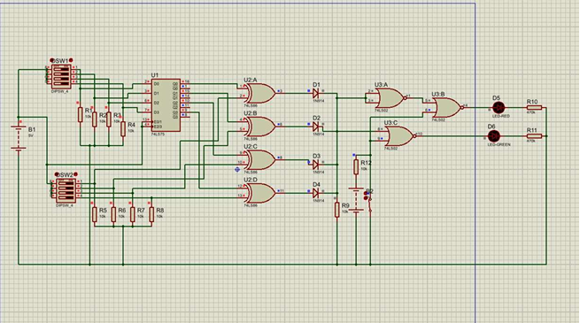
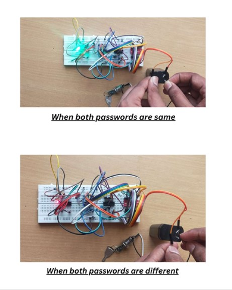

# 🔐 4-bit Password Protected Security System

A Digital Electronics Lab project using logic gates and latches — no microcontroller required.

## 🛠 Overview
This system uses:
- A 7475 D Latch to store a 4-bit password
- 7486 XOR gates to compare stored and entered passwords
- 7402 NOR gates and diode logic to generate output
- DIP switches for user interaction
- LEDs for visual output (Green = Match, Red = Mismatch)

## ⚙️ Working Principle
1. Password is stored using a DIP switch and the latch (Enable = HIGH).
2. User enters a 4-bit input using another DIP switch.
3. XOR gates compare inputs bit-by-bit.
4. If matched → Green LED glows. If any mismatch → Red LED glows.

## 🧪 Simulation
The circuit is simulated using Tinkercad.

🔗 **Tinkercad Circuit Simulation Link:**  
[Click here to open in Tinkercad](PASTE-YOUR-LINK-HERE)

## 🖼️ Media
### 📸 Circuit Diagram

### 🔌 Breadboard Implementation

## 📄 Project Report
See [Project_Report.pdf](./Project_Report.pdf) for full documentation and procedure.

## 📦 Components Used
- 7475 D Latch  
- 7486 XOR Gate  
- 7402 NOR Gate  
- DIP Switches (x2)  
- Diodes, LEDs, Resistors  
- Breadboard, 4V Battery

---

### 📚 Learning Outcome
- Digital logic design using Latch + XOR + NOR
- Password verification using pure hardware
- Circuit debugging, Tinkercad simulation, and teamwork

---

> Built as part of the **Digital Electronics Lab** course at NIT Agartala.
